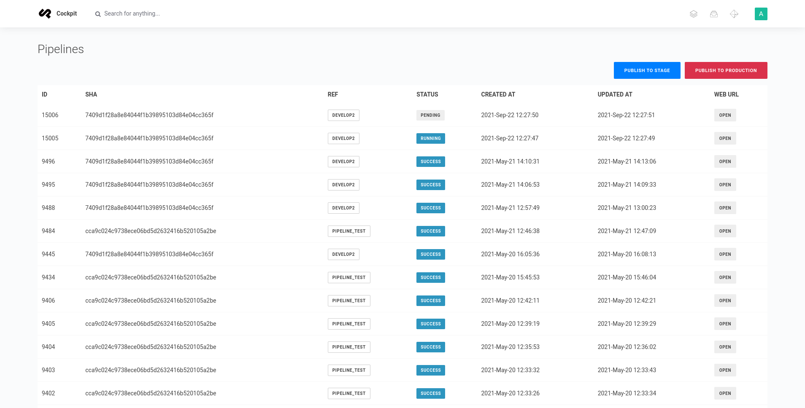

# Pipelines

Cockpit addon listing Gitlab pipelines statuses for single project and enabling you to execute them from Admin dashboard.



You can access widget by clicking on Publish panel in settings.

## Dev Setup

1. Generate your [Private Token](https://docs.gitlab.com/ee/user/profile/personal_access_tokens.html) by entering repositories Settings -> Access Tokens
   
   Note you will need `api` scope for token to work.
2. `git clone git@github.com:performancemedia/cockpit-pipeline.git`
3. `cd cockpit-pipeline`
4. `cp pipelines.json.template pipelines.json`
5. Edit `pipelines.json`
   - `project_id` can be found under project's name in gitlab
   - `branch` are whatever your stage and production branches are
   - `schedule_id` can be found in CI/CD -> Schedules -> Edit Schedule in breadcrumb panel
     
     Note stage and prod branches require separate schedules
   - `api_version` is any api version supported by gitlab e.x. `v4`
   - `gitlab_url` is valid url pointing to gitlab instance e.x. `https://gitlab.performance-media.pl/`
6. `docker-compose up -d`
7. Init Cockpit by visiting `0.0.0.0:8080/install`

## Prod Setup

1. Follow _Dev Setup_ steps up to step 5.
2. copy `Pipelines` directory into `addons` folder
3. copy `pipelines.json.template` to `storage/pipelines.json`

### pipelines.json structure
```json
{
  "private_token": <PRIVATE_TOKEN>, 
  "project_id": <PROJECT_ID>,
  "ref": {
    "prod": {
      "branch": <PROD_BRANCH>,
      "schedule_id": <PROD_SCHEDULE_ID>
    },
    "stage": {
      "branch": <STAGE_BRANCH>,
      "schedule_id": <STAGE_SCHEDULE_ID>
    }
  },
  "api_version": <GITLAB_API_VERSION>,
  "gitlab_url": <GITLAB_URL>
}
```
